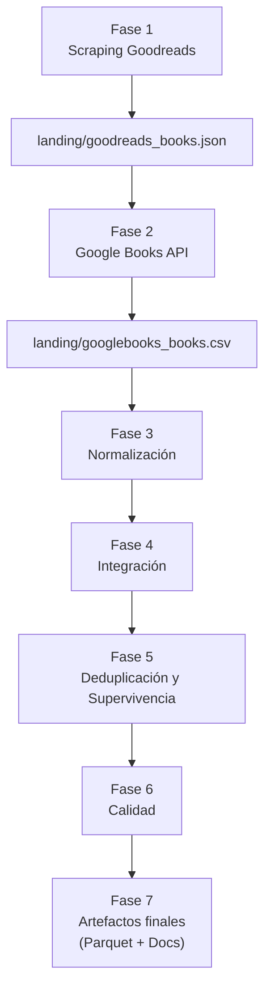
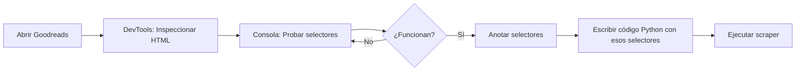

# Proyecto *SBD_PROYECTO_UT1_RA1* - pipeline de libros

por *Borja Ramos Oliva*

---

## Introducción

A continuación presento la **memoria / documentación** del Proyecto RA1.  
Aquí he juntado tanto los aspectos técnicos como la narrativa del proceso, los errores reales encontrados y el razonamiento detrás de cada decisión.

El objetivo general fue construir un pipeline de datos compuesto por:

- **Adquisición** desde Goodreads mediante scraping
- **Enriquecimiento** desde Google Books API
- **Normalización** semántica
- **Integración** de fuentes
- **Deduplicación** mediante reglas de supervivencia
- **Calidad** y aserciones
- **Emisión de artefactos** (Parquet y documentación)

Este proyecto reproduce problemas reales que podemos encontrar en tareas que se encuentran en producción a nivel empresarial

---

## Antes de nada: por qué he elegido el tema “Barbacoa”?

Aunque en el enunciado aparecía la sección "Data Science", no era estrictamente obligatorio. Hemos cambiado a otro tema más interesante y más adecuado al fin de semana.
Sin haberlo planeado, encontré justo lo que buscamos con este tema: **caos útil**.

Preguntamos:  
> *“¿Qué devuelve Goodreads cuando buscas ‘barbacoa’?”*

El resultado fue muy bueno para el ejercicio:

## Lo bueno del dataset
- Mezcla de géneros: cocina, novela, cuadernos vacíos, revistas...
- Títulos muy distintos para obras similares.
- Falta casi total de ISBN.
- Varias ediciones con metadatos contradictorios.
- Idiomas variados.
- Ratings dispares.

Un ejemplo ideal para:

- normalización,
- conciliación,
- reglas de supervivencia,
- deduplicación,
- calidad de datos.

## Lo malo *(aunque en realidad son ventajas)*
- Precios escasos  
- Fechas incompletas  
- ISBN inexistentes  
- Categorías incoherentes  

Todo ello **simula un problema industrial real** donde los datos no vienen limpios ni uniformes.

---

## Explicación breve de qué es un pipeline de datos


Podemos obtener información de los libros buscados de diferentes fuentes,
pero no todas tienen la información completa, así que usamos:


| Fuente | Qué aporta |
|--------|------------|
| Goodreads | popularidad, ratings, ediciones |
| Google Books | metadatos editoriales, fechas, categorías |

El pipeline sirve para:

- **unir** información parcial,
- **limpiar** inconsistencias,
- **normalizar** datos, para que tengan coherencia
- **detectar duplicados**,
- **crear un modelo único** (`dim_book`),
- **conservar trazabilidad** (de dónde salió cada dato),
- **evaluación** del resultado final.


---

## Arquitectura general



---

## Fase 1 — Scraping Goodreads

- Se usó `requests` con `USER_AGENT` real.  
- Parser: **lxml** más rápido y robusto que html parser, aunque se suele usar en proyectos más grandes 
- Selectores detectados desde DevTools:
  - `tr[itemtype*="Book"]`
  - `.bookTitle`
  - `.minirating`
  - `[itemprop="author"]`

Campos extraídos:

- título  
- autor  
- rating  
- nº ratings  
- URL  
- ISBN (si existía)  
- año de publicación (cuando aparecía)

Salida:  
**`landing/goodreads_books.json`**

## Trabajo previo al scraping: análisis manual y preparación

Antes de escribir código realizamos un análisis manual del HTML:

- Localización de contenedores de libros mediante DevTools.
- Identificación de selectores: `.bookTitle`, `.minirating`, `[itemprop="author"]`, etc.
- Verificación de estructura repetitiva de filas `<tr itemtype="Book">`.
- Evaluación de disponibilidad de ISBN y año de publicación.

# Qué hemos hecho y para qué

Antes de escribir código Python para scrapear Goodreads, necesitábamos descubrir los selectores CSS correctos. Es decir, identificar cómo está estructurado el HTML de la página para poder extraer los datos que necesitamos.
El problema es que cuando haces web scraping, no puedes simplemente decir "dame los títulos de los libros". Hay que ser específico:

¿En qué etiqueta HTML está el título? (```<a>, <span>, <h3>```?)
¿Qué clase CSS tiene? (```.bookTitle, .title, .book-name```?)
¿Cómo se estructura cada libro en la página?

Con lo cual, exploramos con las DevTools
---
Paso 1: Identificar el contenedor de cada libro
```javascript
document.querySelectorAll('tr[itemtype*="Book"]')
```

Esto busca todos los elementos <tr> que tengan un atributo itemtype que contenga la palabra "Book". Nos devolvió 19 elementos → 19 libros en la página.
---
Paso 2: Explorar el primer libro
```javascript
let libro = libros[0];
console.log(libro.innerHTML);
```
Esto nos mostró todo el HTML del primer libro para ver su estructura interna.
---
Paso 3: Extraer datos específicos
```javascript
let titulo = libro.querySelector('a.bookTitle')?.textContent.trim();
```
Probamos si el selector a.bookTitle funciona para obtener el título. El ?. es para evitar errores si no existe.
---
Paso 4-7: Probar todos los selectores
```javascript
let autor = libro.querySelector('[itemprop="author"]')?.textContent.trim();
let url = libro.querySelector('a.bookTitle')?.href;
let ratingText = libro.querySelector('.minirating')?.textContent.trim();
```
***

*¿Por qué lo hicimos en la consola y no directamente en Python?*

Feedback instantáneo → Ves el resultado al momento, sin ejecutar todo el script
Iteración rápida → Si un selector falla, pruebas otro en 2 segundos
Mismo motor de rendering → La consola usa el mismo HTML que verá Python (con BeautifulSoup)
Depuración visual → Puedes hacer hover sobre elementos, ver el árbol DOM, etc.

*Si hubiéramos empezado directamente con Python:*

Escribir código → ejecutar → ver error → cambiar selector → repetir
Cada iteración toma 30-60 segundos (más lento)
Más difícil de debuggear sin ver el HTML renderizado
___

Resumen del flujo de trabajo


### Los selectores que encontramos y funcionan

| Dato | Selector CSS | Ejemplo de salida |
|------|--------------|-------------------|
| **Contenedor de libro** | `tr[itemtype*="Book"]` | 19 elementos encontrados |
| **Título** | `a.bookTitle` | "Barbacoa, Bomba, and Betrayal..." |
| **Autor** | `[itemprop="author"]` | "Raquel V. Reyes (Goodreads Author)" |
| **URL** | `a.bookTitle` (atributo `href`) | `/book/show/122948707-...` |
| **Rating** | `.minirating` | "3.70 avg rating — 591 ratings" |

Una vez hecho este ejercicio previo, sabemos exactamente qué selectores usar, podemos escribir el script Python (scrape_goodreads.py) con confianza, porque ya sabemos que funcionan. El no hacer este paso, podría provocar, programando a ciegas, errores de selectores incorrectos

Así que ejecutamos:

```python
python3 src/scrape_goodreads.py
```
Salida:  
**`landing/goodreads_books.json`**

---

## Fase 2 — Enriquecimiento Google Books API

Estrategia de búsqueda:

1. ISBN13  
2. ISBN10  
3. título + autor  

Google Books retorna:

- título y subtítulo  
- autores  
- editorial  
- fecha  
- idioma  
- categorías  
- páginas  
- precio  
- ISBNs  

Salida:  
**`landing/googlebooks_books.csv`**

---

## Fase 3 — Normalización

*Fechas*
- ISO‐8601 estricta  
- Fechas incompletas se completan:  
  - `YYYY` → `YYYY‑01‑01`  
  - `YYYY‑MM` → `YYYY‑MM‑01`

*Idioma*
- BCP‑47  
- todo en minúsculas

*Moneda*
- ISO‑4217

*ISBN*
- limpieza  
- validación  
- conversión ISBN10 → ISBN13  

*Esquema*
- nombres snake_case  
- trims, casts y correcciones básicas  

---

## Fase 4 — Modelo canónico (ID libro)

Reglas para `book_id`:

1. ISBN13 válido → **ID**  
2. ISBN10 válido → convertir → **ID**  
3. Sin ISBN válido →  
   hash MD5 de:  
   `titulo_normalizado + autor + editorial + anio`

---

## Fase 5 — Integración, deduplicación y supervivencia

*Consolidación por atributos normalizados*

La unión se hace sobre:

- título normalizado  
- autor normalizado  
- editorial  
- año aproximado  

*Reglas de supervivencia*

- **Título →** el más completo  
- **Autores →** unión sin duplicados  
- **Editorial →** Google Books > Goodreads  
- **Precio →** Google Books (si existe)  
- **Fecha →** la más precisa  
- **Categorías →** unión  
- **Rating →** Goodreads  
- **Fuente ganadora →** la más completa  

Resultado final:  
**31 libros únicos** desde 40 registros.

---

## Fase 6 — Calidad de datos

Genera:

`docs/quality_metrics.json`

Métricas destacadas:

- Completitud de título → **96.8%**  
- ISBN válidos → **0%** (esperado por el dataset)  
- Duplicados resueltos → **9**  
- Total libros finales → **31**  
- Rango de precios → `[2.65, 35.99]`

---

## Fase 7 — Artefactos finales

Tras haber ejecutado anteriormente:
```python
python3 src/integrate_pipeline.py
```

Salidas:

- `standard/dim_book.parquet` (1 libro = 1 fila)  
- `standard/book_source_detail.parquet` (trazabilidad completa)  
- `docs/schema.md` (documentación del modelo)  
- `docs/quality_metrics.json` (métricas calculadas)

---

## Errores reales encontrados --> soluciones aplicadas

A continuación describo los problemas con los que me encontré haciendo el ejercicio:

### *Goodreads sin ISBN al escrapear de goodreads*  
→ clave alternativa MD5

### *Google Books devolvía múltiples ediciones*  
→ supervivencia reforzada

#### *`'Series' object has no attribute 'columns'`*  
→ devolución incorrecta en supervivencia → arreglado

#### *KeyError: 'autores_lista_gb'*
Este error ocurrió durante la fase de deduplicación. La función de supervivencia esperaba trabajar con dos columnas diferenciadas:

- `autores_lista_gr` — autores provenientes de Goodreads  
- `autores_lista_gb` — autores provenientes de Google Books  

Pero despues de hacer el merge, esas columnas no existían con esos nombres. Dependiendo del mapeo y los sufijos aplicados en pandas, a veces existía solo una columna (`autores_lista`) o los sufijos no se generaban

Esto provocó un **KeyError**, ya que la función intentaba acceder a `fila['autores_lista_gb']`, columna que no estaba presente en el dataframe consolidado.

**Solución aplicada:**
- Ajustar el mapeo previo al merge para garantizar que las columnas de autores se normalizasen y renombrasen correctamente.
- Incorporar comprobaciones defensivas en la función de supervivencia (por ejemplo, verificando si la columna existe antes de acceder a ella).
- Unificar la lógica de autores para que siempre genere listas consistentes, evitando dependencias frágiles entre sufijos.

Con este ajuste, la deduplicación volvió a funcionar sin errores y con trazabilidad completa.
### *Títulos incompletos (3.2% inicial)*  
→ aplicar supervivencia también en grupos de tamaño 1

### *Rutas incorrectas desde /src*  
→ ejecutar siempre desde raíz

### *Autores inconsistentes*  
→ normalización previa

### *Falta de pyarrow*  
→ instalación vía conda

---

# Conclusiones

El pipeline resultante:

- cumple todos los requisitos del proyecto? -- Sí
- resuelve casos reales de inconsistencia? -- Sí 
- consolida fuentes heterogéneas? -- Sí
- implementa supervivencia y trazabilidad profesional? -- Sí
- ofrece un modelo final limpio y usable? -- Sí

---

# Mejoras para futuro

### -- Fuzzy‑matching en títulos y autores  
Para mejorar la unión cuando los textos son parecidos pero no iguales.

### -- Dockerizar el pipeline completo  
Para que el proyecto pueda ejecutarse en un entorno **aislado, reproducible y profesional**, sin depender de la máquina del usuario.

### -- Detectar cambios estructurales en Goodreads  
Automatizar alertas si el HTML cambia y rompe el scraper.

### -- Logs estructurados (JSON logging)  
Mejora la trazabilidad y facilita depuración en producción.

### -- Dashboard de métricas  
Para visualizar completitud, duplicados, ediciones y calidad.

### -- RAG para consultar libros  
Permitir búsquedas semánticas usando modelos de lenguaje.

---

### *Fin del dossier*  
